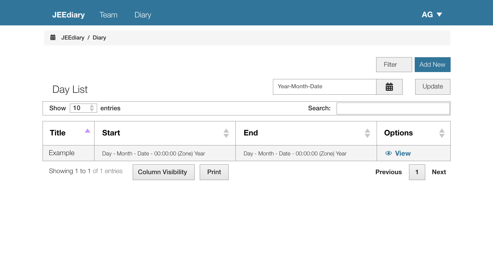

# Design Specification

Alexander Graham (UP812259)

## Revised Design

After initial feedback and a change in user interface framework (switched to BootsFaces) an updated design specification was required. This is below. Note: these are mockups designed with the framework in mind. The framework implementation may look slightly different on the finished product.

### Login

The Login page was deigned to be simple and easy to use requiring just an email and password. To use the system the user must already be registered and cannot use it until an admin creates them an account.

Users enter their email address and password then click ‘Log In’ to log into the system. If there is an issue it will appear in a bootstrap error message above the Log In button and the problem field will be surrounded in red.

### Team View

Once logged into the application all the screens follow a consistent look. There are breadcrumbs for easy navigation around the system. The currently logged in user appears at the top right of the navigation bar and when clicking shows a dropdown offering the ability to view their details, reset their password and logout.

There are also quick links to the Team and Diary sections of the application allowing the user to quickly navigate the application.

On the right of the view there is an 'Add New' button visible to system admins allowing them to create new team members through the corresponding form.

All the team members in the system are shown in a datagrid (BootStrap component) allowing the user to choose how many entries on a page, search for people, as well as search and print the information. If the user selects view next to a team member that team member's full profile will be shown in the view team member view.

### Create Team Member

This form is only available to application admins and allows the creation of new team members. 

It can be accessed from the button on the Team View.

The view contains all the fields as required in the specification, and compulsory fields are indicated by an asterisk. Once the form is completed the user hits Create and the form is validated. If there is an issue it will appear in a bootstrap error message above the Create button and the problem field will be surrounded in red. If there are no issues the team member will be created and the user will be directed to the view team member view showing their newly create team member.

### View Team Member

The view shows a team member's profile. There is a distinct header at the top as with most pages allowing the user to quickly determine where they are in the application. They then get the usual breadcrumbs showing them where they are in the application, providing links back to previous pages.

The change password and edit links are shown if the team member is looking at their own profile or are an admin and take the user to the respective view. If the user is an admin looking at other team members' profiles they can also see a delete option. On click this opens a modal which asks them to confirm their action. If they do confirm the action the team member is deleted and the current user is redirected to the team view.

The contact details section contains the team member's phone number and email, both with links so on press they will launch an application the user can use to contact them with.

Finally, the address is shown below if the team member has provided it.

### Edit Team Member

This view is similar to the create view except it is pre-populated with the team member's details. The password options are not present as there is already a facility to update the team members' password and there is an admin toggle present. This is only visible to admins and only active for profiles that are not their own (to stop them from removing the only admin if they are the only admin).

On pressing the update button the form is updated if it validates correctly, else the error message is shown above the update button as consistent with other forms.

### Change Password

The change password form is accessible from the user's dropdown in the main nav bar to change their own password and if they are an admin they also get the option on the view team member page so they can let other users back into the system should they lose their login details.

### Diary

The diary view is similar to the team member view in layout but instead shows appointments and has some more options. The first two of these are the filter button and add new button in the top right corner. The filter button loads a modal containing buttons to switch what data is visible in the data grid. The options are personal (the current logged in user's diary appointments or ones they are a participant for), email (where the user can change to view another users' appointments by entering their email address), or all (where all events are shown for a day). If a user cannot be found by email all appointments for a given day are shown.

The input field on the right of the Day List title shows the date appointments are being shown for. The user can type a new date or click the date picker icon to show the Bootstrap data picker and select one. They then click update to update the events shown in the system.

### Create Appointment

The style of the create appointment form is consistent with the create team member form but with different fields allowing the user to set the appointment title, start and end times, details and attendees. The user adds attendees by entering their email address into the bot and clicking the add button. If they are a valid team member their name will appear above as a link. If they click the team member's name they can be removed again.

Upon form submission the team members are then checked for event clashes. If there are clashes the event is not created and these are flagged up in a message above the create button. Once valid appointment details are entered and the user hits Create the event is then setup. After this the user is redirected to the view appointment screen where they can see their newly created appointment.

### View Appointment

The view appointment screen shows the the details for a given appointment including the appointment's title, start/end dates and times, and attendees. On clicking an attendee they are taken to the view team member view for that team member so they can view their details.

The delete and edit buttons are shown for an appointment's creator and admins. The edit button directs the user to the edit appointment view and delete button shows a modal allowing the user to confirm their choice or cancel the operation (the way this looks can be seen in the second mockup - this is also how the modal appears for deleting team members).

### Edit Appointment

This form works in the same way as the create form except it is preloaded with the appointment's data and clicking update will update the existing appointment rather than creating a new one.

## Original Design

This is the original design which was not implemented

### Login View

User enters email address and password then clicks ‘Login’ to log into the system. If there is an issue it will appear in red next to where they entered it.

### Appointments View for a Day/Person

- This can be chosen by selecting the correct tab at the bottom of the screen
- You can also create a new one by clicking the add appointment button and view the details of one by clicking on the details button of the correct card.
- Finally, you can adjust the view using the dropdowns on the right-hand side of the UX

### New/Edit Appointment View

- Used to create or edit appointments in the diary
- User can get back to the previous screen using the back button in the left of the nav bar at the top of the screen
- If used for editing appointment the screen loads prefilled and the button says update instead of create
- Error messages appear in red on the screen if there is a problem with the entered data after validation

### Appointment View

- Shows all the details of an appointment and provides links to edit or delete an appointment in the top right of the nav bar

### Team View (shows list of all the contacts in the system)

- This can be chosen by selecting the correct tab at the bottom of the screen
- Selecting a team member brings up the view team member view where you can add them
- Selecting the three-dot menu in the top right of the screen allows for the user to edit their profile/ change their password

### Team Member View

- Shows all the contact details of a team member

### New/Edit Team Member View

- Used to create or edit team member details
- User can get back to the previous screen using the back button in the left of the nav bar at the top of the screen
- If used for editing team member details the screen loads prefilled and the button says update instead of create
- Error messages appear in red on the screen if there is a problem with the entered data after validation

