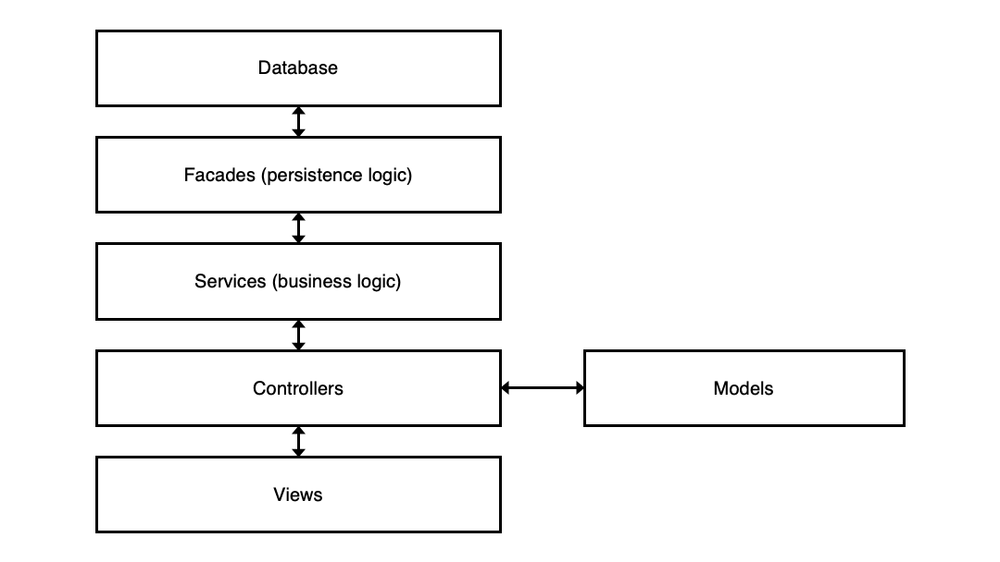

# Project Report: JEEdiary a Team Diary Java EE Web Application

UP812259

Word Count: 1571

## Contents

- [Project Report: JEEdiary a Team Diary Java EE Web Application](#project-report-jeediary-a-team-diary-java-ee-web-application)
  - [Contents](#contents)
  - [Introduction](#introduction)
  - [Design](#design)
    - [User Interface](#user-interface)
    - [Architecture](#architecture)
    - [Database Design](#database-design)
    - [Information Flow Diagram](#information-flow-diagram)
  - [Implementation and Testing](#implementation-and-testing)
    - [User Experience](#user-experience)
    - [Business Logic and Persistence](#business-logic-and-persistence)
    - [Authentication](#authentication)
  - [Summary](#summary)
    - [Positives](#positives)
    - [Improvements](#improvements)
  - [References](#references)

## Introduction

JEEdiary is a team diary consisting of both an address book and diary. Its aim is to allow a team to easily access team members' contact details and plan appointments for themselves and other members of the team. The application was based on the Java EE standard and can be on Java EE servers such as GlassFish.

## Design

### User Interface

Originally, I had decided to build a user interface with the Material Design Language, which can be seen in the design specification. This however changed during implementation due to the difficulty of implementing it. There is no "official" support for material design within Java EE Facelets. Later on, a Bootstrap based interface was designed because of great library support making it easy to work with. The other consideration was the time available for the project and not having the resource to build my own UI components.

### Architecture

In terms of the application itself I used a MVC design approach aiming to keep the application as modular as possible. Justification for this include code reuse (for example data models can be used across multiple views) and simplified structure (so you know where to look for different code). Whilst at times this level of code splitting felt laborious ultimately it helped with debugging as expanded in implementation.

Behind the MVC layer the business code was split into a "service layer" with different services tending to different tasks. The purpose for this was again code reusability. This allowed for business logic to be reused across various controllers for different views and made it easy to manage. There was a final layer between the database and this logic which was the persistence layer, composed of facades for each database table. The advantage for using this is simple access to database queries and objects using just functions.

### Database Design

The database was a SQL database so required a relational database approach. Fundamentally the database was made up of three tables. One was the Team Members, this could have been broken down into related tables but as this was unlikely to change and for simplicity in design was kept as a single table. The Diary appointments were then in another table containing the core information of the appointment such as the title and times. The participants were split into another table acting as a key containing the ID of the event and team member. The justification is that SQL databases do not allow for lists or arrays in tables and as this is a many to many relationship a mechanism to hold this data was required and alternatives like a list of comma separated values is messy.

### Information Flow Diagram

The following diagram shows how the data moves between the layers of the application:

## Implementation and Testing

### User Experience

The application was developed on the latest OpenJDK and Jakarta EE 8 (Open source Java EE implementation) to take advantage of the latest security patches and bug fixes. Code was written using NetBeans 11.3 due to its great support for Java EE development with tools like code completion and native integration with development servers including GlassFish (used in this project).

The core user interface was written in XHTML using JSF and the BootsFaces library. This was one of the easiest parts of development because JSF is powerful but also simple. It's similarity to using standard HTML without having to worry about Javascript and direct integration with controllers made pages easy to build and edit. The BootsFaces library was used as it provided a suite of ui components allowing me to build a responsive application using advanced layout features without having to write them myself which I would not have time to do this project whilst also implementing all the functionality.

One UI area that presented issues however was navigation. The native way involves returning resources instead of URLs in the controller which makes it difficult to pass parameters. The reason for the parameters is to make reusable urls that are shareable and bookmark-able for the user (e.g. 'view-appointment.xhtml' is useless if you want to view a specific appointment whereas 'view-appointment.xhtml?id=123' goes to a specific appointment with the ID 123). To get around this I used a different method of navigation by not returning a resource and instead redirecting the user to a specific URL (that of the resource).

Another problematic area was dealing with Dates. The date picker components are written in JavaScript and use a different format to Java so needed reformatting when converting between the Facelet and model. This involved some trial an error as the way date formats also differed.

The testing of the user experience involved going through each page individually and testing each button. All validators were checked with valid data, and of of any bounds of the validator to make sure it was rejected.

### Business Logic and Persistence

This area was largely straightforward. Businesses logic was written using standard Java classes, making use of Enterprise Java Bean functionally along with object Injection and bean scoping to access the different layers of the application. The database used was the inbuilt Glassfish server application as it provides all the usual SQL database functionality however as it is running on the same server, is easy to configure. Database interaction was completed using the Java Persistence API and JPQL due to its native integration with JavaEE keeping the structure simple.

A more challenging aspect of this project is querying for event conflicts. This wasn't so technically challenging, more difficult getting the logic correct and was partly done through trial and error. To test this section of the application I performed the queries directly using NetBeans with predefined data and looked at the results manually, ensuring should a bug occur it is in the business logic.

### Authentication

Authentication was probably one of the most difficult parts of the application to implement. To speed up the process I used the Java Security API as it provided much of the access control I required, such as making parts of the application unaccessible without logging in first. The reason it caused problems is I implemented it quite late in the development process after much of the team member code had been written. When going to integrate with the native database authentication model I found it expected groups and hashing which was not easy to integrate with my work. I ended up implementing my own custom integration to get around this.

Authentication was primarily tested using a signed in user, admin and no authentication. Each page was inspected to make sure it was only accessible if the user had permission and was logged into the application.

## Summary

### Positives

Through the coursework I have developed a functioning team diary application. There are various areas I am pleased with such as the user experience. I feel the MVC model worked well here and would say the interface implement with Facelets is one of the most successful areas of the application due to being responsive and clean. Whilst not using the normal URL convention for a Java EE application I would do it the same again due to its user friendliness.

Another area I think worked well was the separation of different types of logic, having business logic split from persistence and UI logic made debugging easier due to the clear distinction of code location. It also really helped speeding up development so I would recommend it in the future.

### Improvements

In hindsight, one of the areas I would do differently would be to consider authentication much earlier. Although it is easier to develop without having to login, the lack of pre-planning made it difficult to implement and I would have designed my database differently.

Another area I would consider is whether to use the native persistence APIs. The reason being there are database technologies that may be more suited to this task. For example a NoSQL database may have a document model allowing for storing arrays on a record, removing the need for tables like the participant table and heavily reducing the number of queries performed. Having said this the integration of the persistence API did make interacting with the data easy.

Overall the project went well with all compulsory requirements met. Given more time a calendar would be a nice addition however the project is functional with no found bugs and completes all tasks as required so could be considered a success.

## References

Here are some of the resource I found useful in the process of developing this application:

Baeldung. (2019). Jakarta EE 8 Security API. Retrieved April 1, 2020, from https://www.baeldung.com/java-ee-8-security

Cook, J. (2019). Java String to Date. Retrieved April 1, 2020, from: https://www.baeldung.com/java-string-to-date

Heffelfinger, D. R. (2017). Java EE 8 Application Development (1st ed.; A. Lazar, K. Sadawana, S. Chavan, L. Veigas, & M. Singh, Eds.). Birmingham: Packt Publishing.

JPA - JPQL. (2020). Retrieved April 1, 2020, from: https://www.tutorialspoint.com/jpa/jpa_jpql.htm

TheCoder4Eu. (2018). BootsFaces Showcase. Retrieved April 1, 2020, from https://showcase.bootsfaces.net/
